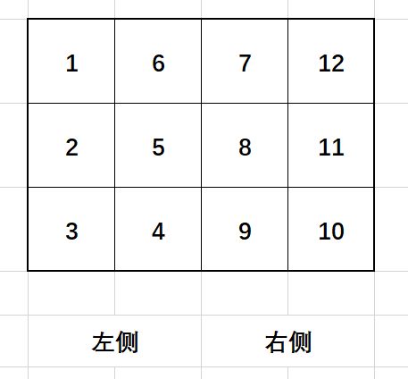
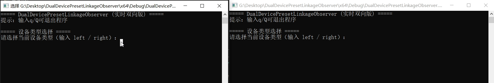
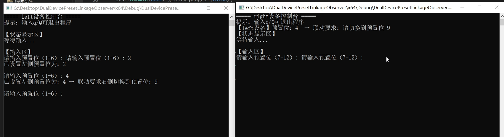

# DualDevicePresetLinkageObserver
简写：DDPresetObserver（双设备预置位联动观测）

如下图所示：

我有两套设备，负责采集左侧和右侧区域，每侧区域可以分成6个区间。

物体会在这12个区间内移动，当物体均在左侧或者右侧进行移动时，我调用左侧或者右侧的设备进行跟踪即可，但是当物体从左侧移动到右侧区域，我需要联动另一侧的设备。

然后我需要解决两套设备的联调问题，即：
- 当左侧设备处在4-6区间的时候，右侧设备需要处在9-7区间候着，防止丢失跟踪目标。
- 同理，当右侧设备处在7-9区间的时候，左侧设备需要处在6-4区间候着，防止丢失跟踪目标。
- 当物体处在1-3，10-12区间时，则不进行联动。
## usage
1. 双开应用，一个输入left，一个输入right

2. 输入区域数字

一个软件输入区域后，另外一个软件会实时提示当前区域以及是否需要进行联动要求。
